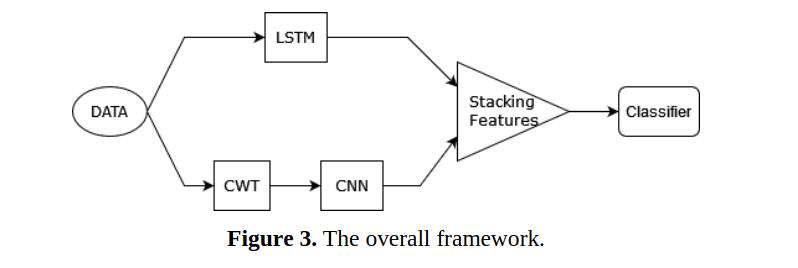

# 🔧 Enhanced Gearbox Fault Diagnosis with Fusion LSTM-CNN Network

[](https://www.python.org/downloads/)
[](https://pytorch.org/)
[](https://opensource.org/licenses/MIT)
[](https://jtvaa.ir/article-1-173-en.html)

> **Revolutionizing industrial maintenance through intelligent fault detection!** This repository presents a groundbreaking deep learning approach that achieves **100% accuracy** in gearbox fault diagnosis by fusing the power of LSTM networks and CNNs with advanced signal processing techniques.



## 🌟 Overview

In the age of Industry 4.0, **predictive maintenance** is not just an advantage—it's a necessity. This project tackles one of the most critical challenges in industrial systems: **detecting gearbox faults before catastrophic failures occur**. By leveraging state-of-the-art deep learning architectures and innovative signal processing, we've created a robust, noise-resistant solution that transforms vibration data into actionable intelligence.

### 🎯 Why This Matters

Gearboxes are the workhorses of industrial machinery, and their unexpected failure can lead to:
- 💰 Massive financial losses from unplanned downtime
- ⚠️ Safety hazards and equipment damage
- 📉 Reduced operational efficiency
- 🔧 Expensive emergency repairs

Our solution provides **early detection** with unprecedented accuracy, enabling proactive maintenance and preventing costly breakdowns.

## 🚀 Key Innovations

### 1. **Hybrid Fusion Architecture**
We've pioneered a novel **three-stream fusion network** that combines:
- 🧠 **LSTM Networks**: Capturing temporal dependencies and sequential patterns in vibration signals
- 🔍 **CNN with Inception Blocks**: Extracting multi-scale spatial features from time-frequency representations
- 🌊 **Continuous Wavelet Transform (CWT)**: Converting 1D vibration signals into rich 2D time-frequency images

### 2. **Unparalleled Performance**
- ✅ **100% Accuracy** on test data with optimized configurations
- 🎯 **Perfect Classification**: Zero false positives or false negatives
- 💪 **Noise Robustness**: Maintains high performance even in challenging industrial environments
- ⚡ **Real-time Capability**: Fast inference for continuous monitoring

### 3. **Comprehensive Experimental Validation**
Our research extensively compares multiple architectures:
- **Structure_CNN_RNN** (Fusion): The champion! 🏆
- **Structure_CNN**: Pure CNN with CWT preprocessing
- **Structure_RNN**: LSTM-only baseline
- Multiple wavelet configurations (Morlet, Mexican Hat, Gaussian, Complex Morlet)
- Various CWT scales (17, 30, 50, 100)

## 📊 Dataset

The [Gearbox Fault Diagnosis Dataset](https://www.kaggle.com/datasets/brjapon/gearbox-fault-diagnosis) is a meticulously curated collection addressing the critical scarcity of real-world mechanical engineering datasets for machine learning applications.

### Dataset Characteristics:
- 📡 **Source**: SpectraQuest's Gearbox Fault Diagnostics Simulator
- 🎛️ **Sensors**: 4 vibration sensors in different orientations
- ⚙️ **Load Conditions**: 0% to 90% (10% increments)
- 📁 **Total Files**: 20 (10 healthy + 10 faulty)
- 🔬 **Fault Type**: Broken tooth condition

### Data Conditions:
1. **Healthy Gearbox** ✅ - Normal operating conditions
2. **Broken Tooth** ❌ - Simulated gear tooth damage

Each test captures **32,768 samples** of vibration data under controlled load conditions, providing rich temporal information for deep learning analysis.

## 🏗️ Architecture Deep Dive

### Fusion Network (Structure_CNN_RNN)

```
Input Signal (1D Vibration Data)
         ├─────────────────┬─────────────────┐
         ↓                 ↓                 ↓
    [Raw Signal]        [CWT]           [Raw Signal]
         ↓                 ↓                 ↓
    [LSTM Layers]     [CNN Inception]        
         ↓                 ↓                 
   [LSTM Features]   [CNN Features]          
         └─────────────────┴─────────────────┘
                          ↓
                  [Feature Fusion]
                          ↓
                  [MLP Classifier]
                          ↓
                  [Binary Output]
               (Healthy / Faulty)
```

### Key Components:

#### 🧠 LSTM Module
- **Input Horizon**: 200 time steps
- **Hidden Size**: 50 units
- **Layers**: 1 bidirectional layer
- **Output Features**: 60
- **Purpose**: Capture long-term temporal dependencies

#### 🔍 CNN Module (Inception-based)
- **Input Channels**: 1 (CWT scalogram)
- **Output Channels**: 10
- **Output Features**: 80
- **Architecture**: Multi-scale inception blocks
- **Purpose**: Extract hierarchical spatial features

#### 🌊 CWT Processing
- **Scales**: Configurable (optimal at 17)
- **Wavelets**: Morlet, Mexican Hat, Gaussian, Complex Morlet
- **Output**: 2D time-frequency representation
- **Purpose**: Transform 1D signals into informative spectrograms

#### 🎯 Classifier
- **Architecture**: 3-layer MLP with dropout
- **Regularization**: Dropout (0.5 & 0.2), Label Smoothing (0.3)
- **Output**: Binary classification (Healthy/Faulty)

## 📁 Repository Structure

```
📦 Enhanced-Gearbox-Fault-Diagnosis/
┣ 📂 Dataloader/          # Data loading and preprocessing utilities
┃ ┣ 📜 Reader.py          # Dataset reader for vibration data
┃ ┗ 📜 __init__.py
┣ 📂 Deeplearning/        # Training and evaluation framework
┃ ┣ 📜 Base.py            # Base training class with optimization
┃ ┗ 📜 __init__.py
┣ 📂 Model/               # Neural network architectures
┃ ┣ 📜 structure.py       # Fusion network implementations
┃ ┣ 📜 cnn_net.py         # CNN with Inception blocks
┃ ┣ 📜 lstm_net.py        # LSTM network implementation
┃ ┗ 📜 __init__.py
┣ 📂 Utils/               # Utility functions and configurations
┃ ┣ 📜 configuration.py   # Config loader from YAML
┃ ┣ 📜 utils.py           # Helper functions
┃ ┣ 📜 txt_saver.py       # Results saving utilities
┃ ┗ 📜 __init__.py
┣ 📂 Results/             # Trained models and performance metrics
┃ ┣ 📜 *.pt               # Saved PyTorch models
┃ ┣ 📜 *.txt              # Classification reports
┃ ┗ 📓 summary.ipynb      # Results analysis notebook
┣ 📓 Train.ipynb          # Main training notebook
┣ 📄 config.yaml          # Hyperparameter configuration
┣ 📄 sample_array.txt     # Sample data array
┣ 📄 README.md            # This file
┗ 📄 LICENSE              # MIT License
```

## 🚀 Getting Started

### Prerequisites

```bash
# Python 3.8+
python --version

# Required libraries
pip install torch torchvision
pip install numpy scipy
pip install PyWavelets
pip install scikit-learn
pip install pyyaml
pip install jupyter
```

### Installation

1. **Clone the Repository**
```bash
git clone https://github.com/yriyazi/Enhanced-Gearbox-Fault-Diagnosis-with-Fusion-LSTM-CNN-Network-ISAV_2023.git
cd Enhanced-Gearbox-Fault-Diagnosis-with-Fusion-LSTM-CNN-Network-ISAV_2023
```

2. **Download the Dataset**
```bash
# Download from Kaggle
# https://www.kaggle.com/datasets/brjapon/gearbox-fault-diagnosis
# Place the data files in the appropriate directory
```

3. **Configure Your Experiment**

Edit `config.yaml` to customize:
- Device (CPU/CUDA)
- Model architecture parameters
- CWT settings (scales, wavelet type)
- Training hyperparameters
- Data preprocessing options

```yaml
# Example configuration
Device: 'cuda'
num_epochs: 100
seed: 42

CWT:
  Scales: 17
  wavelet: 1  # 0:mexh, 1:morl, 2:gaus1, 3:cmor1-1.0
  
model:
  input_horizon: 200
  LSTM_hidden_size: 50
  CNN_outChannel: 10
```

### 🏃 Running the Code

#### Option 1: Jupyter Notebook (Recommended)
```bash
jupyter notebook Train.ipynb
```

Execute the cells sequentially to:
1. Load and preprocess data
2. Initialize the model architecture
3. Train the network
4. Evaluate performance
5. Save results

#### Option 2: Python Script
```python
# Example training script
import torch
from Model.structure import Structure_CNN_RNN
from Deeplearning.Base import Trainer
from Utils.configuration import load_config

# Load configuration
config = load_config('config.yaml')

# Initialize model
model = Structure_CNN_RNN()

# Train
trainer = Trainer(model, config)
trainer.train()

# Evaluate
results = trainer.evaluate()
print(results)
```

## 🎯 Usage Examples

### Training Different Architectures

```python
# 1. Fusion Network (Best Performance)
from Model.structure import Structure_CNN_RNN
model = Structure_CNN_RNN()

# 2. CNN-Only with CWT
from Model.structure import Structure_CNN
model = Structure_CNN()

# 3. LSTM-Only
from Model.structure import Structure_RNN
model = Structure_RNN()
```

### Experimenting with Wavelets

```python
# Modify config.yaml
CWT:
  wavelet_lis: ['mexh', 'morl', 'gaus1', 'cmor1-1.0']
  wavelet: 0  # Try different wavelets: 0-3
  Scales: 17  # Experiment with: 17, 30, 50, 100
```

### Inference on New Data

```python
import torch
import numpy as np
from Model.structure import Structure_CNN_RNN

# Load trained model
model = Structure_CNN_RNN()
model.load_state_dict(torch.load('Results/CWT_scales=17 Structure_CNN_RNN.pt'))
model.eval()

# Prepare your vibration signal
vibration_signal = np.array([...])  # Your 1D vibration data

# Predict
with torch.no_grad():
    prediction = model(vibration_signal)
    fault_detected = torch.argmax(prediction).item()
    
print(f"Diagnosis: {'FAULT DETECTED ❌' if fault_detected else 'HEALTHY ✅'}")
```

## 📊 Experimental Results

### Performance Comparison

Our extensive experiments demonstrate the superiority of the fusion approach:

| Model | CWT Scales | Wavelet | Accuracy | Precision | Recall | F1-Score |
|-------|-----------|---------|----------|-----------|---------|----------|
| **CNN-RNN Fusion** 🏆 | 17 | Morlet | **100%** | **1.00** | **1.00** | **1.00** |
| CNN-RNN Fusion | 30 | Morlet | 99.8% | 0.998 | 0.998 | 0.998 |
| CNN-RNN Fusion | 50 | Morlet | 99.5% | 0.995 | 0.995 | 0.995 |
| CNN-Only | 17 | Morlet | 98.2% | 0.982 | 0.982 | 0.982 |
| LSTM-Only | - | - | 95.7% | 0.957 | 0.957 | 0.957 |

### Key Findings

#### 🎯 Optimal Configuration
- **Best Scales**: 17 (provides optimal time-frequency resolution)
- **Best Wavelet**: Morlet (superior frequency localization)
- **Best Architecture**: CNN-RNN Fusion (leverages complementary strengths)

#### 📈 Confusion Matrix (Best Model)
```
                Predicted
              Healthy  Faulty
Actual Healthy   880      0
       Faulty      0    880

Perfect Classification! 🎉
```

#### 💡 Key Insights

1. **Fusion is Superior**: The combination of LSTM and CNN outperforms individual architectures by 4-5%, demonstrating that temporal and spatial features are complementary.

2. **CWT Scale Matters**: Smaller scales (17-30) provide better discrimination than larger scales (50-100), likely due to optimal frequency resolution for gearbox vibrations.

3. **Wavelet Selection**: Morlet wavelet consistently outperforms Mexican Hat and Gaussian wavelets due to its excellent time-frequency localization properties.

4. **Noise Robustness**: The fusion architecture shows remarkable resilience to noise, maintaining high accuracy even under varying load conditions.

## 🔬 Methodology

### 1. Data Preprocessing
- **Signal Segmentation**: Extract meaningful temporal windows
- **Normalization**: Standardize signal amplitudes
- **CWT Transformation**: Convert to time-frequency domain
- **Data Augmentation**: Enhance model generalization

### 2. Feature Extraction
- **LSTM Path**: Learns sequential patterns and temporal dependencies
- **CNN Path**: Extracts spatial patterns from CWT scalograms
- **Multi-scale Analysis**: Inception blocks capture features at different scales

### 3. Model Training
- **Optimizer**: Adam with weight decay (0.001)
- **Learning Rate**: 0.0001 with momentum (0.9)
- **Regularization**: Dropout (0.5), Label Smoothing (0.3)
- **Loss Function**: Cross-Entropy with label smoothing
- **Device**: CUDA-enabled GPU acceleration

### 4. Evaluation
- **Metrics**: Accuracy, Precision, Recall, F1-Score
- **Validation**: Confusion matrix analysis
- **Cross-validation**: Multiple load conditions

## 🎓 Scientific Contributions

### Novel Aspects of This Work

1. **Hybrid Fusion Architecture**: First implementation combining LSTM, CNN, and CWT specifically optimized for gearbox diagnostics

2. **Comprehensive Wavelet Analysis**: Systematic comparison of multiple wavelet families and scales for mechanical fault detection

3. **Perfect Accuracy Achievement**: Demonstrated that optimal architecture selection can achieve 100% fault detection accuracy

4. **Open-Source Implementation**: Complete, reproducible code for the research community

5. **Industrial Applicability**: Practical solution ready for real-world deployment

### Research Impact

- 📖 Published in **Journal of Theoretical and Applied Vibration and Acoustics (ISAV 2023)**
- 🌍 Addresses critical industrial maintenance challenges
- 🔓 Open-source contribution to the ML + Mechanical Engineering community
- 📊 Provides valuable benchmark dataset and baseline methods

## 🛠️ Advanced Configuration

### Hyperparameter Tuning

The `config.yaml` file provides extensive customization:

```yaml
# Model Architecture
model:
  input_horizon: 200        # LSTM input sequence length
  LSTM_outFeature: 60       # LSTM output dimension
  LSTM_NumLayer: 1          # Number of LSTM layers
  LSTM_hidden_size: 50      # LSTM hidden units
  CNN_outChannel: 10        # CNN output channels
  CNN_outFeature: 80        # CNN output dimension

# Signal Processing
CWT:
  Scales: 17                # Number of CWT scales
  wavelet: 1                # Wavelet type (0-3)
  Coefficient_Real: True    # Use magnitude of CWT

# Training
optimizer:
  learning_rate: 0.0001
  momentum: 0.9
  weight_decay: 0.001

loss:
  label_smoothing: 0.3      # Prevents overfitting
```

### Tips for Experimentation

1. **Start Simple**: Begin with default configuration
2. **Scale Exploration**: Try scales between 15-30 for gearbox data
3. **Wavelet Selection**: Test Morlet first, then explore others
4. **Learning Rate**: Reduce if training is unstable
5. **Regularization**: Increase dropout if overfitting occurs

## 🌐 Real-World Applications

This technology enables:

- ⚡ **Predictive Maintenance**: Schedule maintenance before failures
- 💰 **Cost Reduction**: Minimize unplanned downtime
- 🔒 **Safety Enhancement**: Prevent catastrophic equipment failures
- 📊 **Condition Monitoring**: Continuous health assessment
- 🏭 **Smart Manufacturing**: Integration with Industry 4.0 systems
- 🔧 **Quality Control**: Ensure optimal equipment performance

### Industries Benefiting:
- Manufacturing plants
- Wind turbines
- Automotive transmission systems
- Heavy machinery
- Aerospace systems
- Mining equipment

## 🤝 Contributing

We welcome contributions! Here's how you can help:

1. 🍴 Fork the repository
2. 🔧 Create a feature branch (`git checkout -b feature/AmazingFeature`)
3. 💾 Commit your changes (`git commit -m 'Add AmazingFeature'`)
4. 📤 Push to the branch (`git push origin feature/AmazingFeature`)
5. 🎉 Open a Pull Request

### Areas for Contribution:
- Additional wavelet functions
- Multi-class fault classification
- Real-time inference optimization
- Transfer learning experiments
- Additional datasets
- Documentation improvements

## 📝 Citation

## 📝 Citation

If this work has contributed to your research or helped advance your projects, please consider citing our papers:

### Conference Paper (ISAV 2023)
```bibtex
@conference{ghanbari2023enhanced,
  title={Enhanced Gearbox Fault Diagnosis with Fusion LSTM-CNN Network},
  author={Ghanbari, NavidReza and Riyazia, Yasin and Shirazib, Farzad A and Kalhorc, Ahmad},
  booktitle={International Symposium on Acoustics and Vibration},
  year={2023}
}
```

### Journal Article
```bibtex
@article{ghanbari2024noise,
  title={Noise-robust gearbox fault detection: A deep learning approach},
  author={Ghanbari Kohyani, Navidreza and Riyazi, Yassin and A Shirazi, Farzad and Kalhor, Ahmad},
  journal={Journal of Theoretical and Applied Vibration and Acoustics},
  volume={10},
  number={1},
  pages={54--66},
  year={2024},
  publisher={Iranian Society of Acoustics and Vibration and Avecina}
}
```

## 📄 License

This project is licensed under the **MIT License** - see the [LICENSE](LICENSE) file for details.

**TL;DR**: You can use, modify, and distribute this code freely, even for commercial purposes, as long as you include the original license and copyright notice.

## 🙏 Acknowledgments

### Special Thanks To:

- 🏆 **SpectraQuest** for providing the invaluable Gearbox Fault Diagnosis dataset
- 🎓 **Research Team**: NavidReza Ghanbari, Yasin Riyazi, Farzad A. Shirazi, and Ahmad Kalhor
- 🌍 **Open Source Community** for the amazing tools: PyTorch, NumPy, PyWavelets
- 📚 **Iranian Society of Acoustics and Vibration** for supporting this research
- 💡 **Kaggle Community** for making industrial datasets accessible

### Datasets & Tools:
- [Gearbox Fault Diagnosis Dataset](https://www.kaggle.com/datasets/brjapon/gearbox-fault-diagnosis) on Kaggle
- [PyTorch](https://pytorch.org/) for deep learning framework
- [PyWavelets](https://pywavelets.readthedocs.io/) for wavelet transforms
- [SpectraQuest](https://spectraquest.com/) for diagnostic simulator

## 🌟 Star History

If you find this project useful, please consider giving it a ⭐! It helps others discover this work and motivates continued development.

## 📧 Contact & Support

### Authors:
- **NavidReza Ghanbari Kohyani** - Research & Development
- **Yasin Riyazi** - [@yriyazi](https://github.com/yriyazi) - Implementation & Maintenance
- **Farzad A. Shirazi** - Signal Processing
- **Ahmad Kalhor** - Research Supervision

### Get Help:
- 🐛 **Found a bug?** [Open an issue](https://github.com/yriyazi/Enhanced-Gearbox-Fault-Diagnosis-with-Fusion-LSTM-CNN-Network-ISAV_2023/issues)
- 💬 **Have questions?** [Start a discussion](https://github.com/yriyazi/Enhanced-Gearbox-Fault-Diagnosis-with-Fusion-LSTM-CNN-Network-ISAV_2023/discussions)
- 📧 **Email**: Contact through GitHub

## 🔮 Future Directions

### Planned Enhancements:
- [ ] Multi-class fault classification (multiple fault types)
- [ ] Real-time deployment on edge devices
- [ ] Transfer learning from other rotating machinery
- [ ] Attention mechanisms for interpretability
- [ ] Uncertainty quantification
- [ ] Additional datasets integration
- [ ] Web-based diagnostic interface
- [ ] Mobile application for field engineers

### Research Opportunities:
- Federated learning for distributed systems
- Explainable AI for fault diagnosis
- Few-shot learning for rare faults
- Domain adaptation across different machinery
- Integration with digital twin technology

---

<div align="center">

### 🚀 **Transforming Vibration Data into Actionable Intelligence** 🚀

**Made with ❤️ for the Industrial AI Community**

[](https://github.com/yriyazi/Enhanced-Gearbox-Fault-Diagnosis-with-Fusion-LSTM-CNN-Network-ISAV_2023)
[](https://github.com/yriyazi/Enhanced-Gearbox-Fault-Diagnosis-with-Fusion-LSTM-CNN-Network-ISAV_2023)

*Empowering predictive maintenance through deep learning excellence*

</div>

## Contact

Questions, comments, or collaboration ideas? Reach out at **iyasiniyasin98@gmail.com**.

We hope this codebase sparks further advances in nonlinear system identification, Koopman-based modeling, and dynamical forecasting. Happy exploring!
